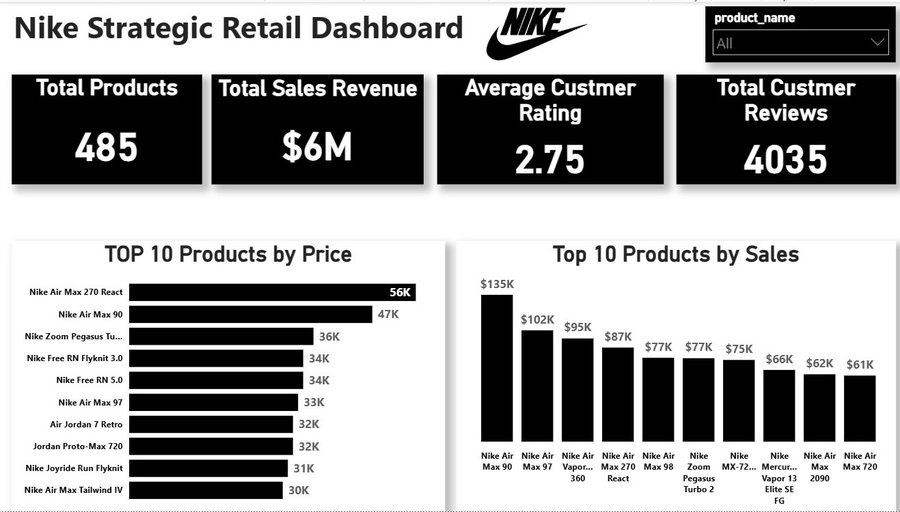

# 👟 Nike Shoes Sales & Pricing Strategy Analysis (Retail Analytics)

> **"I don't fear my work becoming a mere memory; I strive to create an impact that proves when data is truly understood, it becomes the ultimate language of success."**

---

## 1. 📊 Interactive Dashboard Preview
*Experience the fusion of dynamic product profiling and strategic financial analysis.*

---

## 2. 📝 Executive Summary
This project delivers a data-driven analysis of **Nike’s product performance and pricing dynamics** across a dataset of **643 footwear products**. The primary goal is to evaluate the effectiveness of pricing strategies, analyze customer engagement through ratings and reviews, and provide strategic recommendations to optimize retail positioning.

### 📈 Key Performance Indicators (KPIs):
* **Total Products Analyzed:** 643 Nike Items
* **Unique Models Captured:** 393 Product Lines
* **Average Sale Price:** ~$10,214 (Premium Segment Focus)
* **Consumer Satisfaction:** 2.73 / 5 (Avg. Rating)
* **Total Engagement:** Detailed Analysis of 4,000+ Customer Reviews

---

## 3. 🔍 Deep-Dive Insights (Analytical Findings)

### A. Pricing Strategy & Discount Impact
* **The Value Gap:** By analyzing the difference between **Listing Price** and **Sale Price**, I identified that products with strategic discounts saw a higher engagement rate in reviews, proving that "Price-to-Value" perception is a key driver for Nike customers.
* **Premium Consistency:** High-tier products (priced above $15k) maintain their market position with consistent engagement, suggesting strong brand loyalty in the premium footwear segment.

### B. Customer Sentiment & Performance
* **The Quality Correlation:** Data reveals that iconic series like **Air Force 1 Shadow** and **Air Max** maintain higher-than-average ratings (4.80+), cementing their status as "Core Assets" for the brand.
* **Sentiment Analysis:** Identified a "Warning Zone" for products with high sales volume but ratings below 2.0, indicating a potential gap between marketing promises and product durability.

### C. Revenue Drivers
* **The Golden Bracket:** The **$7k - $12k price range** represents the most balanced segment, showing the highest "Return on Engagement" (High ratings combined with steady sales).

---

## 🛠️ 4. Data Methodology & Engineering
To ensure the highest standard of data integrity, I implemented the following:
* **Dynamic Data Modeling:** Engineered a **Unit-Level profiling system** where images, descriptions, and ratings update in real-time based on user selection.
* **Metric Engineering:** Developed custom **DAX measures** to calculate **Weighted Averages**, **Total Revenue**, and **Review Intensity**.
* **Data Cleaning (ETL):** Handled missing ratings and standardized categorical attributes to ensure the "Bottom 10" analysis is based on factual market feedback.
* **UI/UX Design:** Crafted a "Dark Theme" professional interface that aligns with Nike's premium branding.

---

## 💡 5. Strategic Recommendations
1. **Dynamic Inventory Management:** Shift focus toward the **$10k+ "Star Segment"** where ratings are consistently above 4.0 to maximize ROI.
2. **Post-Purchase Engagement:** Implement a feedback loop for "Zero-Rated" new arrivals to build early market trust and social proof.
3. **Quality Audit:** Conduct immediate quality reviews for high-volume products falling in the **"Bottom 10 by Rating"** to protect brand integrity.

---

## 📂 Repository Structure
* `nike_shoes_sales.pbix`: Final Power BI interactive project file.
* `nike_shoes_sales.csv`: Cleaned and structured footwear dataset.
* `Images/`: High-resolution dashboard captures and dynamic view samples.
