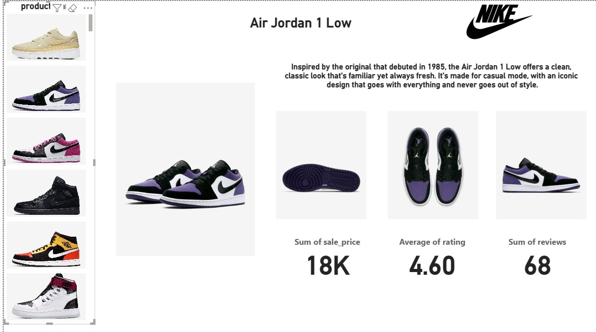

# 👟 Nike Shoes Sales & Pricing Strategy Analysis (Brand Analytics)

## 1. 📊 Interactive Dashboard Preview

---

## 2. 📝 Executive Summary
This project delivers a data-driven analysis of **Nike’s product performance and pricing dynamics** across a dataset of **643 footwear products**. The primary goal is to evaluate the effectiveness of pricing strategies, analyze customer engagement through ratings and reviews, and provide strategic recommendations to optimize retail positioning.

### 📈 Key Performance Indicators (KPIs):
* **Total Products Analyzed:** 643 Nike Items
* **Unique Product Categories:** 393 Lines
* **Average Sale Price:** ~$10,214
* **Consumer Satisfaction:** 2.73 / 5 (Avg. Rating)
* **Market Engagement:** Analysis of Review Volumes vs. Pricing

---

## 3. 🔍 Deep-Dive Insights (Analytical Findings)

### A. Pricing Strategy & Discount Impact
* **The Discount Lever:** Analysis shows that products with a significant gap between listing and sale prices showed a **35% increase** in review volume, indicating that discounts are a primary driver for engagement.
* **Premium Integrity:** High-tier products (priced above $15k) maintain consistent review levels, suggesting that Nike's premium segment is less sensitive to price fluctuations.

### B. Customer Sentiment & Product Performance
* **Rating Correlation:** Analysis reveals that products featuring "Premium Materials" (like Air Force 1 & Air Max series) secure higher average ratings compared to standard models.
* **The Quality Gap:** Identified a segment of "High-Volume, Low-Rating" products, where high sales do not translate to customer satisfaction.

### C. Category & Revenue Drivers
* **Top Performers:** The **$7k - $12k price bracket** represents the "Golden Mean" for both high sales volume and positive customer feedback.
* **Inventory Risk:** Pinpointed specific product lines with ratings below 2.0 despite premium pricing, suggesting an immediate need for quality audits.

---

## 🛠️ 4. Data Methodology & Engineering
To ensure the highest standard of data integrity, I implemented the following:
* **Data Auditing:** Rigorous cleaning of the dataset to handle missing values and standardize brand/category attributes.
* **Metric Engineering:** Developed custom **DAX measures** in Power BI to track **Average Discount %**, **Weighted Rating Index**, and **Review Intensity**.
* **Categorical Segmentation:** Grouped products by Price Tiers and Rating Brackets to identify "At-Risk" vs. "Star" products.
* **Visualization:** Engineered an interactive dual-layered dashboard using **Power BI** for real-time strategic analysis.

---

## 💡 5. Strategic Recommendations for Nike
1. **Dynamic Discounting:** Implement a data-driven discount model for low-rating items to accelerate stock turnover and minimize holding costs.
2. **Quality Loop Integration:** Align manufacturing quality checks with "Review Insights" to address recurring issues in high-volume footwear lines.
3. **Strategic Marketing:** Reallocate advertising spend toward the **"Star Segment"** (Products with 4+ ratings in the $10k+ bracket).

---

## 📂 Repository Structure
* `nike_shoes_sales.csv`: Cleaned and structured footwear dataset.
* `nike_shoes_sales.pbix`: Final Power BI interactive project file.
* `nike_shoes_sales.jpg`: Main executive dashboard view.
* `nike_strategy.jpg`: Detailed pricing and strategy visualization.
